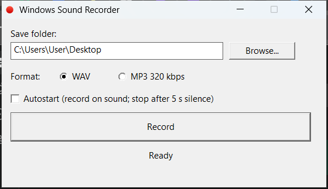

# Windows Sound Recorder



Tiny Windows utility (~1,300 lines of C, no dependencies, no installer, single
~83 KB `.exe`) that records **the sound Windows plays** — the system audio
output — to a `.wav` or `.mp3` file. It captures the speaker/output mix via
WASAPI loopback, **never the microphone**.

Useful for capturing whatever is playing on your PC: streaming audio, video
call output, in-app sounds, music, web players, game audio, and similar — with
no virtual cable or driver to install. It's also a simple way to save audio
from **YouTube, Spotify or any other player as an MP3** — just press Record
(or tick Autostart) while it plays.

## Download

Grab the pre-built executable from the [latest GitHub release](https://github.com/esp3tek/WindowsSoundRecorder/releases/latest):

**[WindowsSoundRecorder.exe](https://github.com/esp3tek/WindowsSoundRecorder/releases/latest/download/WindowsSoundRecorder.exe)** (~83 KB, no installer).

Just double-click to run.

### Verify the binary (optional)

Current build SHA-256:

```
F0FA9EEB982FB5565E8EAD1B7E8AA366F6E6AD5C23AB841F4BFA7A1C7A4DEE70
```

On Windows: `Get-FileHash WindowsSoundRecorder.exe -Algorithm SHA256`

### Windows SmartScreen warning

The first time you run the downloaded `.exe`, Windows SmartScreen may
show **"Windows protected your PC"** because this binary is not signed
with a paid code-signing certificate. The file is safe (you can verify
the SHA-256 above and read the entire source in this repo).

To run it: click **More info** → **Run anyway**.

## Usage

1. Run `WindowsSoundRecorder.exe`. A small window appears.
2. The destination folder defaults to your Desktop; change it with **Browse...**.
3. Pick the **Format**: WAV or MP3 320 kbps.
4. Press **Record**. Press **Stop** to finish.

Each recording is saved as `Recording_YYYY-MM-DD_HHMMSS.wav` / `.mp3` in the
chosen folder, so nothing is ever overwritten.

### Autostart on sound

Tick the **Autostart** box to arm the recorder instead of pressing Record.
It waits silently, starts recording the moment it detects sound on the
output, and stops automatically after **5 seconds of silence** — the trailing
silence is not written to the file — then re-arms for the next sound. Short
pauses inside a track (under 5 s) are kept. Untick the box to stop/disarm.

### Identify song (AudD)

Tick **Identify song (AudD)** to auto-name recordings. When a recording finishes, a short
clip is sent to the [AudD](https://audd.io/) music-recognition service; if it recognises
the track, the file is renamed to `Artist - Title.ext` and (for MP3) ID3 tags are written.
The first time you enable it, the app asks for your AudD API token (free at audd.io) and
stores it in the Windows registry. You can also **leave it empty to use AudD's free tier**
(about 10 songs/day, no account needed).

> **Privacy:** with this option enabled, a short clip of the recorded audio is uploaded to
> AudD's servers over the internet. With it off, the app makes no network connections.

Minimize the window to send it to the system tray. Left-click the tray icon
to restore; right-click for `Show` / `Exit`. Only one instance runs at a time.

## How it works

The app activates the **default render endpoint** with WASAPI in loopback mode
(`AUDCLNT_STREAMFLAGS_LOOPBACK`) and reads the output mix on a dedicated
thread. Because it captures the render endpoint, it records exactly what you
hear and **cannot pick up the microphone**.

Windows delivers the mix as 32-bit float. The recorder converts it to 16-bit
PCM and feeds it to one of two encoders behind a common interface:

- **WAV** — writes a standard PCM header, streams the samples, and patches the
  `RIFF`/`data` sizes on close.
- **MP3** — uses **Windows Media Foundation** (`IMFSinkWriter`) to encode at
  320 kbps CBR. No external library (no LAME) — only system DLLs, so the
  "no dependencies" rule still holds.

For autostart, the capture thread measures the peak level of every buffer.
When it crosses a small threshold it opens a new timestamped file; silence is
held back rather than written, and a wall-clock timer ends the take after 5 s
without sound — robust even when the loopback endpoint stops delivering
buffers while nothing is playing.

## Build from source

Requires either **MSVC** (`cl.exe`) or **MinGW-w64** (`gcc`) on `PATH`.

```
generate_icon.ps1   :: generates icon.ico (first time only)
build.bat
```

Manual MinGW build:

```
windres resources.rc -O coff -o resources.o
gcc sound_recorder.c audio_capture.c wav.c encoder.c audio_util.c mp3_encoder.c tags.c identify.c resources.o -o WindowsSoundRecorder.exe -municode -mwindows -lole32 -luser32 -lgdi32 -lshell32 -luuid -lmfplat -lmf -lmfreadwrite -lmfuuid -lwinhttp -ladvapi32 -s -O2
```

Run the unit tests (sanitize, ID3v2 builder, AudD JSON parser, WAV clip):

```
build_test.bat
```

## License

MIT — see [LICENSE](LICENSE). Copyright (c) 2026 esp3tek.
